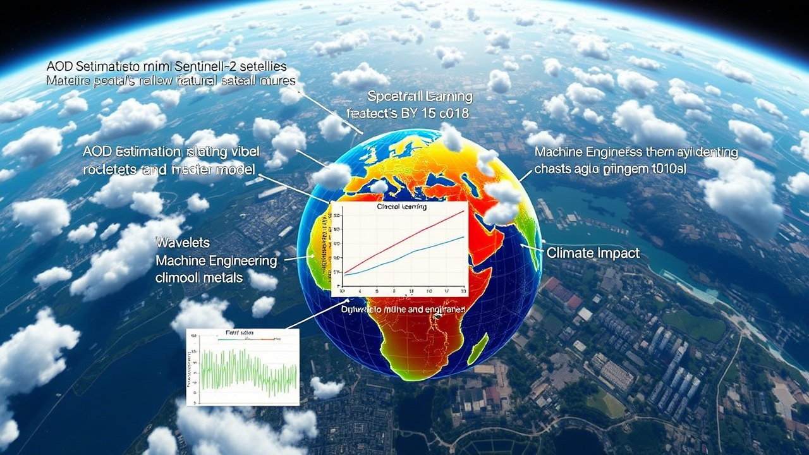

# Aerosol-Optical-Depth-Estimation

 <!-- Replace with actual image if available -->


Aerosol Optical Depth (AOD) plays a pivotal role in understanding atmospheric conditions, climate dynamics, and public health risks associated with air quality. This project presents an innovative methodology for estimating AOD using multi-spectral data from the Sentinel-2 satellite system combined with advanced machine learning techniques.

By leveraging hybrid feature engineering methods — including spectral ratios, wavelet decomposition, and texture analysis — we extracted meaningful features that capture the intricate spatial and spectral behavior of aerosols. A CatBoost Regressor was trained to model the relationship between these engineered features and corresponding AOD values. The model demonstrated robust performance, achieving a mean Pearson correlation coefficient of **0.9640 ± 0.0460** across 200-fold cross-validation.

Key contributions of this approach include:

- **Enhanced Feature Engineering**: Integration of wavelet-based features and Local Binary Patterns (LBP) significantly improved estimation accuracy.
- **Effective Spectral Insights**: Spectral ratios involving visible and near-infrared bands, such as B3/B5 and B1/B8, were identified as strong predictors of aerosol scattering behavior.
- **Improved Methodology**: Addresses limitations of traditional AOD estimation techniques, particularly those related to spatial resolution trade-offs and underutilization of spectral information.

The proposed method demonstrates consistent performance across diverse environmental conditions, making it a valuable tool for environmental monitoring, climate modeling, and health-related policy development. Future work will focus on refining feature extraction strategies for complex environments and incorporating additional datasets to further enhance generalization and scalability.

> For detailed research findings, [read the full paper here](https://acceleron.org.in/index.php/aaj/article/view/231)

---

## Project Structure

```
catboost_aod_project/
├── data/
│   └── raw/                # Raw data files
├── models/                 # Trained models
├── notebooks/
│   └── catboost-depps-aod.ipynb  # Original Jupyter notebook
├── src/
│   ├── catboost_aod/
│   │   ├── __init__.py
│   │   ├── data_processing.py  # Data loading and preprocessing functions
│   │   └── model_training.py   # Model training and evaluation functions
│   └── main.py             # Main script to run the AOD pipeline
├── tests/                  # Unit and integration tests
├── .gitignore              # Git ignore file
├── README.md               # Project README
├── requirements.txt        # Python dependencies
└── setup.py                # Project installation (optional, for larger projects)
```

---

## Setup and Installation

### Step-by-step instructions to get started:

1. **Clone the repository**

   ```bash
   git clone https://github.com/zulqarnainalipk/Aerosol-Optical-Depth-Estimation.git  
   cd catboost_aod_project
   ```

2. **Create a virtual environment (recommended)**

   ```bash
   python -m venv venv
   source venv/bin/activate  # On Windows: venv\Scripts\activate
   ```

3. **Install required dependencies**

   ```bash
   pip install -r requirements.txt
   ```

---

## Usage

### 1. Prepare your dataset

Place your dataset file (e.g., `catboost-depps-aod.csv` or similar) into the following directory:

```bash
data/raw/
```

### 2. Run the AOD Estimation Pipeline

Execute the main script to initiate the complete workflow:

```bash
python src/main.py
```

This script performs the following steps:
- Loads and preprocesses the input data
- Applies feature engineering
- Trains a CatBoost regression model
- Evaluates and reports model performance

---

## Contributing

Contributions are highly encouraged! Please report issues, or propose new features.

---


## Author

**Zulqarnain Ali**  
[LinkedIn Profile](https://www.linkedin.com/in/zulqarnainalipk/)  
Feel free to reach out for collaborations, feedback, or questions regarding the project.

---

> Research Paper Link: [A CatBoost-Based Approach for Aerosol Optical Depth Estimation Using Multi-Spectral Sentinel-2 Data](https://acceleron.org.in/index.php/aaj/article/view/231)
